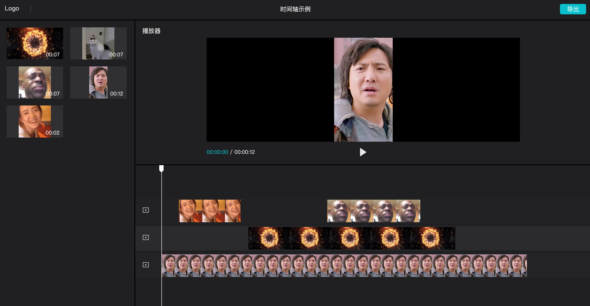

# 简易版剪辑

模仿剪映 Web 功能在一天之内完成一个基本的剪辑功能

## 技术栈

- React
- TypeScript
- Zustand
- ViteJS + Pnpm + Monorepo

## 项目结构

- apps 应用
  - clipper 剪辑应用
- packages
  - store 全局状态
  - types 剪辑数据结构定义

## 功能实现

- [x] 左侧栏
  - [x] 资源加载与展示
  - [x] 点击添加片段
  - [x] 拖拽添加片段
- [ ] 播放器
  - [x] 舞台渲染
  - [x] 播放暂停
  - [ ] 视口调节
  - [ ] 元素拖拉拽
  - [ ] 全屏
- [ ] 时间轴
  - [x] 片段与轨道展示
  - [x] 片段时长调整
  - [x] 片段跨轨道移动
  - [x] 游标展示与交互
  - [x] 删除
  - [ ] 复制
  - [ ] 裁切
  - [ ] 刻度尺
  - [ ] 轨道缩放

## 界面演示

## 遗留问题

- 时间轴的交互还有很多边界场景还没处理
-
